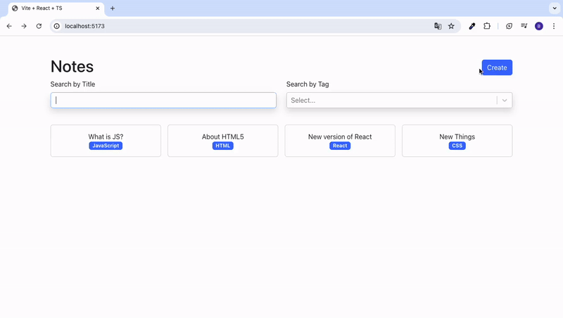

<h1>NOTES APP</h1>

"Notes App" is a robust CRUD application developed with TypeScript, React, and Vite, aimed at providing an efficient note-taking experience. The application incorporates Bootstrap and React Bootstrap for responsive design, React Icons for an extensive icon library, and React Markdown for rendering markdown notes. Navigation is streamlined with React Router DOM, while React Select enhances the user interface with customizable select inputs. UUID is utilized for generating unique identifiers, ensuring data integrity. This project demonstrates a modern tech stack and best practices in TypeScript and React development.

<h2> Software Languages </h2>

- HTML

- CSS

- TypeScript

- JavaScript

<h2> Libraries </h2>

- React

<h2> Framework </h2>

- Bootstrap

<h2> Development Tool </h2>

- Vite

<h3> Minor Libraries </h3>

- React Icons

- React Markdown

- UUID

<h2> Screen Gif </h2>

